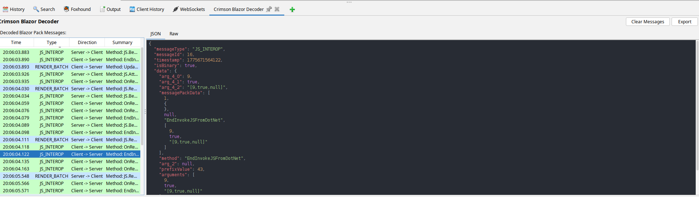

# Crimson Blazor Decoder

An OWASP ZAP add-on that decodes and displays Blazor Pack messages sent over WebSocket connections in real time.

## Screenshot



## Why

Blazor Server applications communicate between the browser and server using the Blazor Pack protocol over SignalR WebSockets. The messages are encoded in a binary MessagePack format that is not human-readable. This makes security testing of Blazor Server applications difficult, as the WebSocket traffic in ZAP appears as opaque binary data.

Crimson Blazor Decoder intercepts these WebSocket messages, decodes the MessagePack payload, and presents the data as pretty-printed JSON in a dedicated ZAP panel, enabling security testers to inspect and analyse Blazor Pack traffic.

## Penetration Testing Blazor Applications

Blazor Server is increasingly used in enterprise web applications. During a penetration test, being able to read Blazor Pack traffic is essential for:

- **Understanding application logic** — Blazor Server renders UI server-side and pushes diffs to the client as `RENDER_BATCH` messages. Decoding these reveals which components are rendering, what data they contain, and how the UI state changes in response to user actions.
- **Identifying sensitive data exposure** — Component state, form values, and server responses all travel over the WebSocket. Decoded messages make it straightforward to spot PII, tokens, or business logic that should not be visible to the client.
- **Mapping JS interop calls** — `JS_INTEROP` messages show every JavaScript function invoked by the server, including method names and arguments. This is useful for finding dangerous sinks or undocumented client-side behaviour.
- **Identifying SignalR circuit endpoints** — Circuit Start and Close messages reveal connection identifiers and negotiation details that can be used to test session handling and connection hijacking scenarios.

Without this add-on, all of the above is hidden inside binary MessagePack blobs that appear as garbage in ZAP's WebSockets tab.

## Features

### Message Decoding
- Real-time decoding of Blazor Pack WebSocket traffic (both text and binary frames)
- Automatic detection of Blazor/SignalR messages using protocol-specific heuristics
- Message categorization: Render Batch, JS Interop, Circuit Start/Close, Error, and more

### Message Table
- Color-coded rows by message type (light blue for Render Batch, light green for JS Interop, light red for Errors)
- Mark/unmark messages for tracking (lime green highlight)
- Auto-scroll to new messages (click any row to disable)
- Status bar showing message count
- Maximum 10,000 messages stored (oldest auto-removed)

### Detail Views
- **JSON Tab**: Syntax-highlighted JSON with One Dark theme colors (keys=red, strings=green, numbers=orange, booleans/null=purple)
- **Raw Tab**: Hex dump with offset, hex bytes, and ASCII columns
- **Modify Tab** (outgoing only): Edit JSON and resend to server
- **RegEx Tab**: Shows regex rule matches

### Regex Security Scanning
- 25 default regex rules for detecting sensitive data:
  - Email addresses, IPv4 addresses, South African ID numbers
  - Credit card numbers, JWT tokens
  - AWS keys, GCP credentials, GitHub tokens, GitLab tokens
  - Private keys (RSA, DSA, EC, ECDSA, OPENSSH)
  - Stripe, Slack, Discord, SendGrid, Twilio, Azure keys
  - Generic secret patterns (key, token, secret, password, api_key)
- Yellow highlighting in table rows and JSON view
- Tooltip on hover shows matching rule names
- Scoped to decoded data fields only (excludes metadata)
- Protected against catastrophic backtracking

### Configuration (Tools → Options → Crimson Blazor Decoder)
- Add/remove/edit regex rules
- Enable/disable rules separately for Client→Server and Server→Client
- Click column headers to toggle all checkboxes
- Pattern validation on edit
- Maximum 200 rules allowed

### Actions
- **Clear Messages**: Remove all decoded messages (with confirmation)
- **Export**: Export selected message as JSON or raw binary
- **Copy**: Right-click copy from detail views
- **Mark/Unmark**: Right-click to flag messages

## Installation

Pre-built releases are available on the [releases page](https://github.com/crimsonwall/crimsonblazordecoder/releases). Download the `.zap` file and install it in ZAP via **File > Load Add-on File...**.

After installation, open the panel via **View > Show Tab > Crimson Blazor Decoder Tab**.

## Documentation

For detailed usage instructions and configuration options, see the [help documentation](https://github.com/crimsonwall/crimsonblazordecoder/blob/main/src/main/resources/com/crimsonwall/crimsonblazordecoder/resources/help.html).

## Building from Source

### Prerequisites

- JDK 17 or later
- A local checkout of [zap-extensions](https://github.com/zaproxy/zap-extensions) with the websocket add-on already built

### Clone and build

```bash
git clone https://github.com/crimsonwall/crimsonblazordecoder.git
cd crimsonblazordecoder
./gradlew jarZapAddOn
```

The built `.zap` file is written to `build/zapAddOn/bin/`.

By default the build looks for `zap-extensions` at `../zap-extensions` (i.e. a sibling directory). If your checkout is elsewhere, pass the path explicitly:

```bash
./gradlew jarZapAddOn -PzapExtensionsDir=/path/to/zap-extensions
```

The websocket add-on jar must already be built inside that checkout:

```bash
cd /path/to/zap-extensions
./gradlew :addOns:websocket:jar
```

### Install in ZAP

Once built, install the add-on via **Tools > Manage Add-ons > Load Add-on from File** and select the `.zap` file, or copy it directly to the ZAP `plugin` directory.

## Requirements

- OWASP ZAP 2.17.0 or later
- The WebSocket add-on (installed by default in ZAP)

## Tips

- **Disable auto-scroll**: Click any row other than the last one to stop auto-scroll and manually inspect previous messages
- **Timestamp tooltips**: Hover over `timestamp` fields in the JSON view to see human-readable dates
- **Modify and resend**: Use the Modify tab on outgoing messages to test how the server handles modified payloads
- **Quick regex toggle**: Click the C→S or S→C column header in options to enable/disable all rules

## Performance

- Maximum 10,000 messages stored in memory
- JSON display truncated to 50,000 characters
- Hex dump display truncated to 4,096 bytes
- Regex matching limited to 5,000 characters per payload
- Character access limited to 100,000 per regex pattern (prevents catastrophic backtracking)

## License

Copyright 2026 crimsonwall.com. Licensed under the Apache License, Version 2.0.

## Contributing

If you encounter issues, please feel free to fix them and submit a pull request. Contributions are welcome.
